# Architecture — 5G Handover DDQN

## High-Level Pipeline

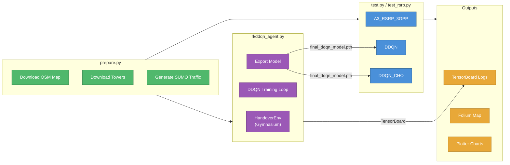

## Data Preparation — prepare.py

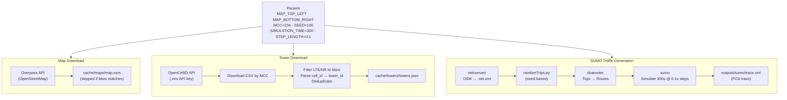

## Data Models

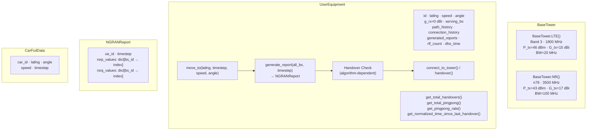

## Signal Model — WaveUtils

### RSRP Calculation Chain

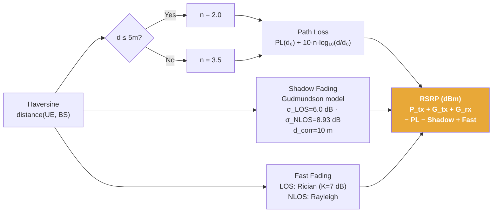

### RSRQ and Index Mapping

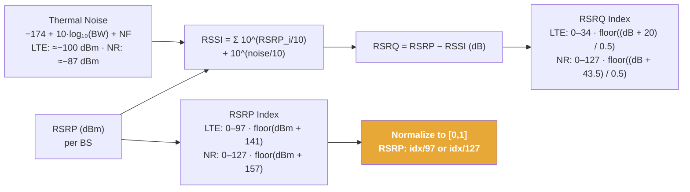

## Handover Algorithms

### A3_RSRP_3GPP

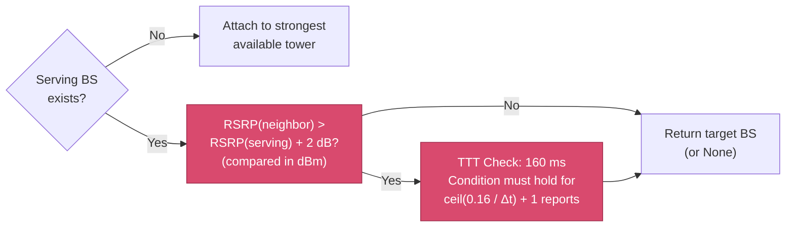

### DDQN (Pure)

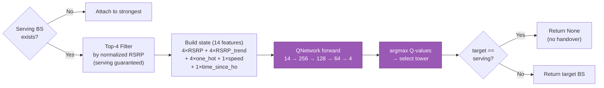

### DDQN_CHO (Confidence-Gated Conditional Handover)

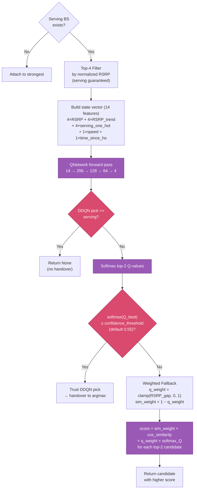

## QNetwork Architecture

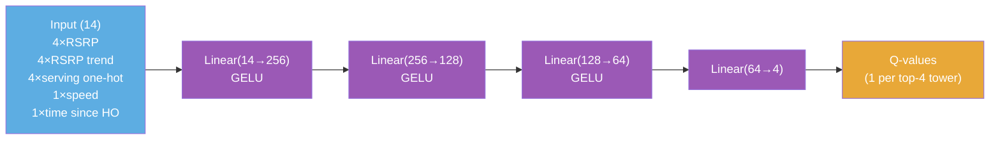

## RL Training — ddqn_agent.py

### Environment and Reward

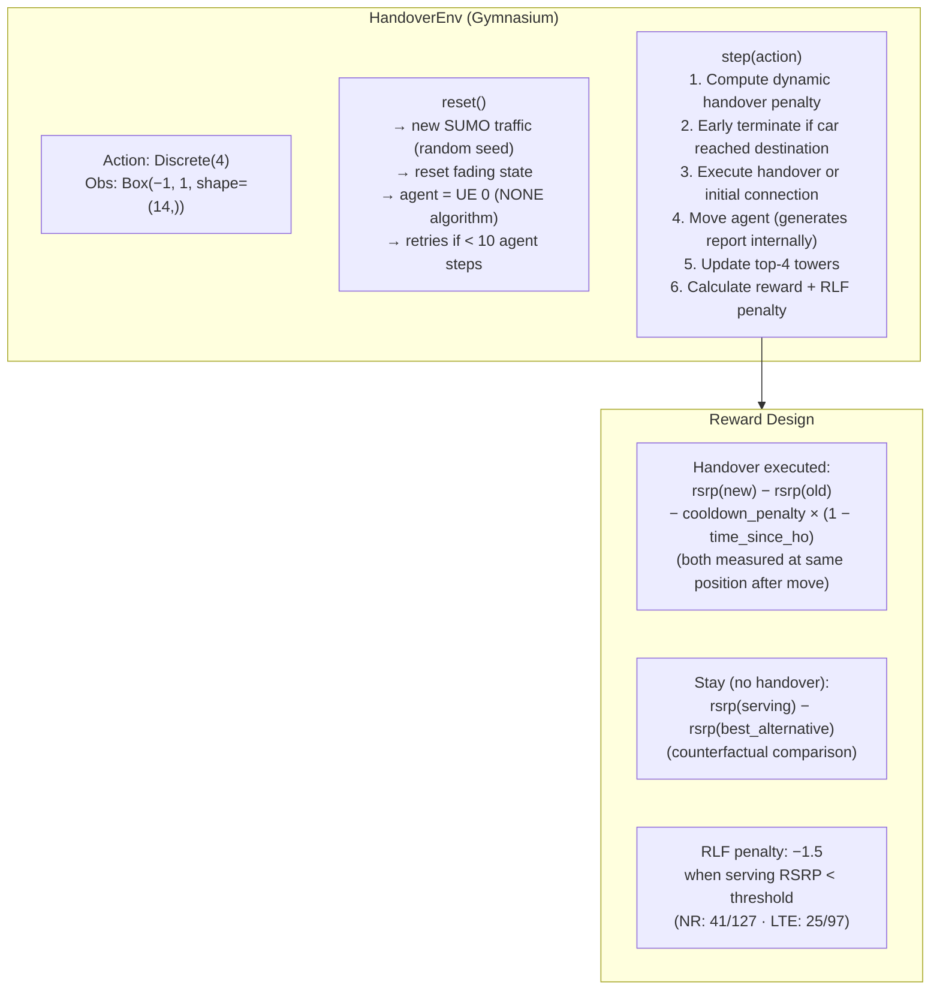

### Training Loop

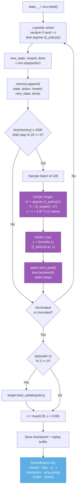

### Hyperparameters

| Parameter | Value |
|---|---|
| Episodes | 800 |
| Learning rate | 5e-4 (Adam) |
| Discount (γ) | 0.97 |
| ε start | 1.0 |
| ε decay | 0.99 per episode |
| ε min | 0.05 |
| Batch size | 128 |
| Min buffer | 1000 |
| Max buffer | 50000 |
| Train every | 20 steps |
| Target update | every 2 episodes (hard copy) |
| Loss | SmoothL1 (Huber) |

## Ping-Pong Detection

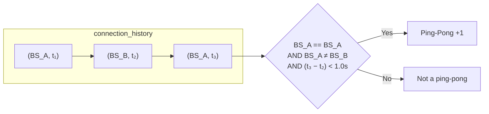

## Simulation — test.py

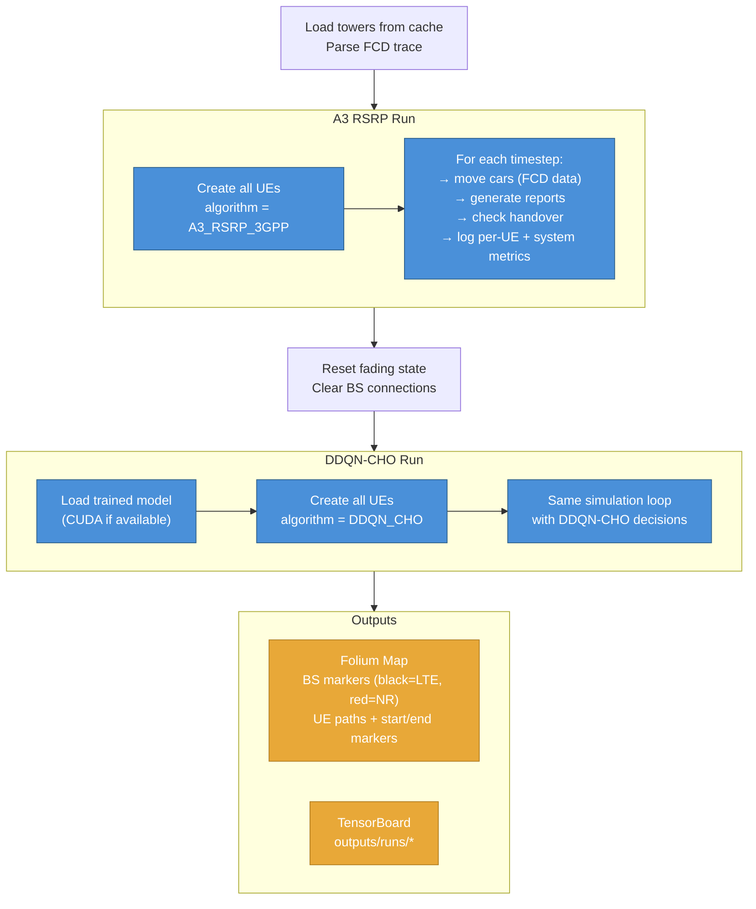

## TensorBoard Logging

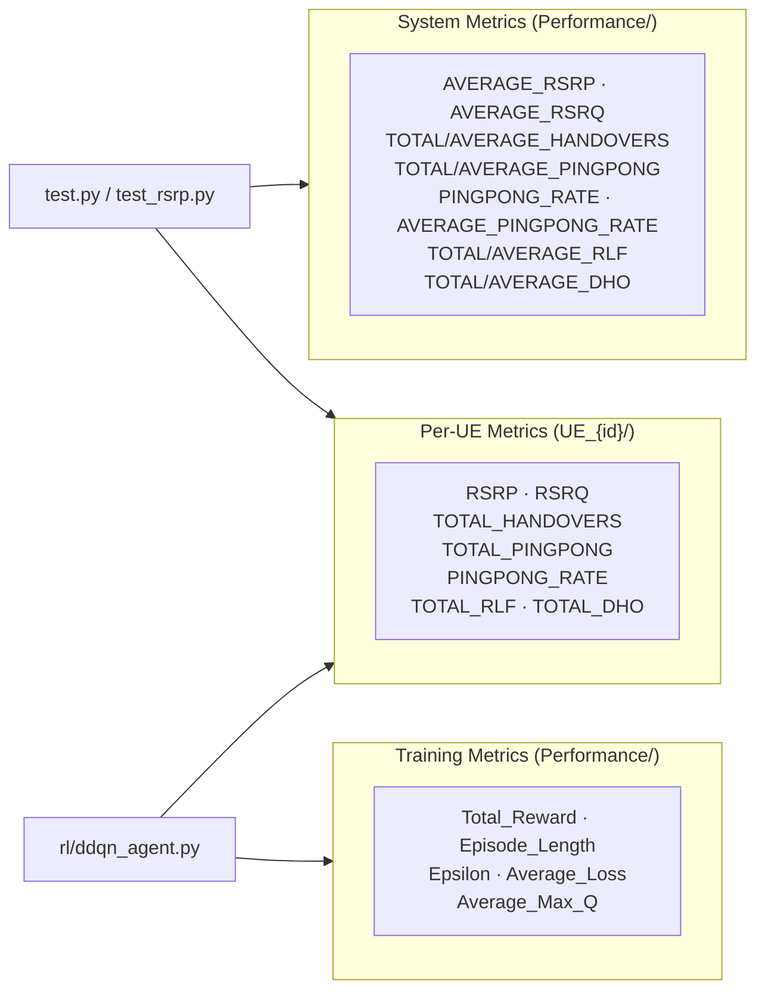
