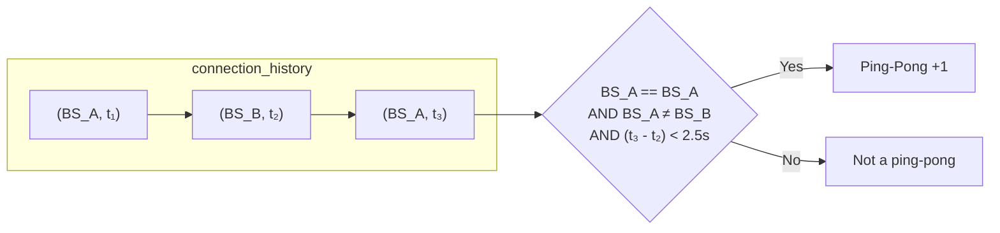
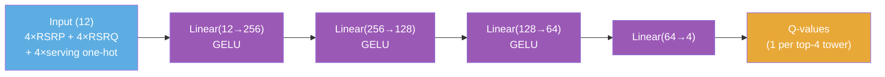
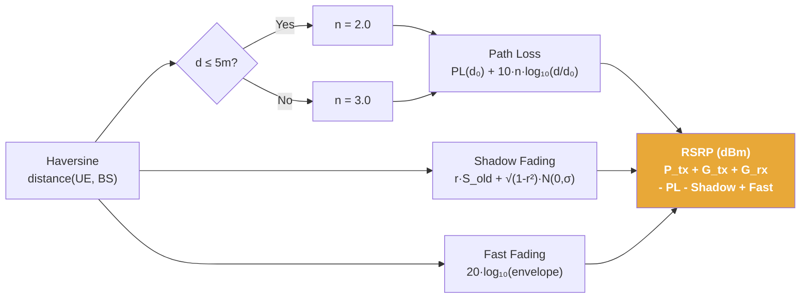

# Architecture — City Car Simulator

## Full System Overview

```mermaid
graph TB
    %% ============================================
    %% ENTRY POINTS
    %% ============================================
    subgraph ENTRY["Entry Points"]
        direction LR
        PREPARE["prepare.py"]
        TEST["test.py"]
        TRAIN["rl/ddqn_agent.py"]
    end

    %% ============================================
    %% DATA PREPARATION (prepare.py)
    %% ============================================
    subgraph DATA_PREP["Data Preparation — prepare.py"]
        direction TB
        P_PARAMS["Params\nMAP_TOP_LEFT · MAP_BOTTOM_RIGHT\nMCC=234 · SEED=200\nSIMULATION_TIME=300 · STEP_LENGTH=0.3"]

        subgraph OSM_DL["Map Download"]
            OVERPASS["Overpass API\n(OpenStreetMap)"]
            OSM_CACHE["cache/maps/map.osm\n(skipped if bbox matches)"]
            OVERPASS --> OSM_CACHE
        end

        subgraph TOWER_DL["Tower Download"]
            OPENCELLID["OpenCellID API\n(.env API key)"]
            TOWER_CSV["Download CSV by MCC"]
            TOWER_FILTER["Filter to bbox\nParse cell_id → tower_id\nDeduplicate"]
            TOWER_CACHE["cache/towers/towers.json"]
            OPENCELLID --> TOWER_CSV --> TOWER_FILTER --> TOWER_CACHE
        end

        subgraph SUMO_GEN["SUMO Traffic Generation — PathGeneration"]
            NETCONVERT["netconvert\nOSM → .net.xml"]
            RANDOM_TRIPS["randomTrips.py\n(seed=random)"]
            DUAROUTER["duarouter\nTrips → Routes"]
            SUMO_SIM["sumo\nSimulate 300s @ 0.3s steps"]
            FCD_OUT["outputs/sumo/trace.xml\n(FCD trace)"]
            NETCONVERT --> RANDOM_TRIPS --> DUAROUTER --> SUMO_SIM --> FCD_OUT
        end

        P_PARAMS --> OSM_DL
        P_PARAMS --> TOWER_DL
        P_PARAMS --> SUMO_GEN
    end

    PREPARE --> DATA_PREP

    %% ============================================
    %% DATA MODELS
    %% ============================================
    subgraph MODELS["Data Models"]
        direction TB

        subgraph BS_MODEL["BaseTower"]
            BS_LTE["BaseTower.LTE()\nBand 3 · 1800 MHz\nP_tx=46 dBm · G_tx=15 dBi\nBW=20 MHz"]
            BS_NR["BaseTower.NR()\nn78 · 3500 MHz\nP_tx=43 dBm · G_tx=17 dBi\nBW=100 MHz"]
        end

        subgraph UE_MODEL["UserEquipment"]
            UE_PROPS["id · latlng · speed · angle\ng_rx=0 dBi · serving_bs\npath_history · connection_history\ngenerated_reports"]
            UE_MOVE["move_to(latlng, timestep, speed, angle)"]
            UE_REPORT["generate_report(all_bs, timestep)\n→ NGRANReport"]
            UE_HO_CHECK["Handover Check\n(algorithm-dependent)"]
            UE_CONNECT["connect_to_tower() / handover()"]
            UE_METRICS["get_total_handovers()\nget_total_pingpong()\nget_pingpong_rate()"]

            UE_MOVE --> UE_REPORT --> UE_HO_CHECK --> UE_CONNECT
        end

        subgraph REPORT_MODEL["NGRANReport"]
            REPORT_FIELDS["ue_id · timestep\nrsrp_values: dict[bs_id → index]\nrsrq_values: dict[bs_id → index]"]
        end

        subgraph FCD_MODEL["CarFcdData"]
            FCD_FIELDS["car_id · latlng · angle\nspeed · timestep"]
        end
    end

    %% ============================================
    %% SIGNAL MODEL (wave_utils.py)
    %% ============================================
    subgraph SIGNAL["Signal Model — WaveUtils"]
        direction TB

        subgraph PATHLOSS["Path Loss (Log-Distance)"]
            PL_FORMULA["PL(d) = PL(d₀) + 10·n·log₁₀(d/d₀)"]
            PL_LOS["LOS (d ≤ 5m): n = 2.0"]
            PL_NLOS["NLOS (d > 5m): n = 3.0"]
            PD0["PL(d₀) = 20·log₁₀(4π·d₀·f_c/c)"]
        end

        subgraph SHADOW["Shadow Fading (Gudmundson)"]
            SHADOW_CORR["r = exp(-d_moved / d_corr)"]
            SHADOW_UPDATE["S_new = r·S_old + √(1-r²)·N(0,σ)"]
            SHADOW_LOS["LOS: σ = 4.0 dB"]
            SHADOW_NLOS["NLOS: σ = 7.82 dB"]
            SHADOW_DCORR["d_corr = 50 m"]
            SHADOW_STATE["State: per-link (ue_id, bs_id)\n→ (last_position, last_value)"]
            SHADOW_CORR --> SHADOW_UPDATE
        end

        subgraph FAST["Fast Fading"]
            FAST_LOS["LOS: Rician\nK = 9 dB\nν = √(K/(K+1))\nσ = √(1/(2(K+1)))"]
            FAST_NLOS["NLOS: Rayleigh\nσ = 1/√2"]
            FAST_ENV["envelope = √(x² + y²)"]
            FAST_DB["20·log₁₀(envelope) dB"]
            FAST_LOS --> FAST_ENV
            FAST_NLOS --> FAST_ENV
            FAST_ENV --> FAST_DB
        end

        subgraph RSRP_CALC["RSRP Calculation"]
            RSRP_FORMULA["RSRP = P_tx + G_tx + G_rx\n- PL(d) - L_shadow + L_fast"]
        end

        subgraph RSSI_CALC["RSSI / RSRQ"]
            NOISE["Thermal Noise\n-174 + 10·log₁₀(BW) + NF\nLTE: ≈-100 dBm\nNR: ≈-87 dBm"]
            RSSI_FORMULA["RSSI = Σ 10^(RSRP_i/10)\n+ 10^(noise/10)"]
            RSRQ_FORMULA["RSRQ = RSRP - RSSI (dB)"]
            NOISE --> RSSI_FORMULA --> RSRQ_FORMULA
        end

        subgraph INDEX_MAP["3GPP Index Mapping"]
            RSRP_IDX_LTE["LTE RSRP: 0–97\nfloor(dBm + 141)"]
            RSRP_IDX_NR["NR RSRP: 0–127\nfloor(dBm + 157)"]
            RSRQ_IDX_LTE["LTE RSRQ: 0–34\nfloor((dB + 20) / 0.5)"]
            RSRQ_IDX_NR["NR RSRQ: 0–127\nfloor((dB + 43.5) / 0.5)"]
            NORM["Normalize to [0,1]\nRSRP: idx/97 or idx/127\nRSRQ: idx/34 or idx/127"]
        end

        PATHLOSS --> RSRP_CALC
        SHADOW --> RSRP_CALC
        FAST --> RSRP_CALC
        RSRP_CALC --> RSSI_CALC
        RSRP_CALC --> INDEX_MAP
        RSSI_CALC --> INDEX_MAP
    end

    UE_REPORT --> SIGNAL

    %% ============================================
    %% HANDOVER ALGORITHMS
    %% ============================================
    subgraph HANDOVER["Handover Decision"]
        direction TB

        subgraph A3["A3_RSRP_3GPP"]
            A3_INIT["No serving BS?\n→ attach to strongest"]
            A3_HOM["RSRP(neighbor) >\nRSRP(serving) + 2 dB?"]
            A3_TTT["TTT Check: 640 ms\nCondition must hold for\nceil(0.64 / Δt) reports"]
            A3_EXEC["Return target BS\n(or None)"]
            A3_INIT --> A3_HOM --> A3_TTT --> A3_EXEC
        end

        subgraph DDQN_HO["DDQN_CHO"]
            D_INIT["No serving BS?\n→ attach to strongest"]
            D_TOP4["Top-4 Filter\n0.5·RSRP + 0.5·RSRQ\n(normalized scores)"]
            D_STATE["Build state vector\n[4×RSRP, 4×RSRQ, 4×one-hot]\n= 12 features"]
            D_QNET["QNetwork forward pass\n12 → 256 → 128 → 64 → 4\n(GELU activations)"]
            D_SOFT["Softmax Q-values\n→ probabilities"]
            D_TOP2["Select top-2\nby softmax score"]
            D_DIR["Direction-Aware Scoring\nbearing(UE → tower)\nsimilarity = cos(θ_UE - θ_tower)"]
            D_WEIGHT["Weighted Score\n0.4·similarity + 0.8·Q_softmax"]
            D_DECIDE["Return tower with\nhigher weighted score"]

            D_INIT --> D_TOP4 --> D_STATE --> D_QNET --> D_SOFT --> D_TOP2 --> D_DIR --> D_WEIGHT --> D_DECIDE
        end
    end

    UE_HO_CHECK --> A3
    UE_HO_CHECK --> DDQN_HO

    %% ============================================
    %% SIMULATION (test.py)
    %% ============================================
    subgraph SIM["Simulation — test.py"]
        direction TB
        T_PARAMS["Flags\nTEST_A3_RSRP=True · TEST_DDQN=True\nSHOW_FOLIUM · SHOW_TENSORBOARD"]
        T_LOAD["Load towers from cache\nParse FCD trace"]

        subgraph SIM_A3["A3 RSRP Run"]
            SA_INIT["Create UEs\nalgorithm=A3_RSRP_3GPP"]
            SA_LOOP["For each timestep:\n→ move cars (FCD data)\n→ generate reports\n→ check handover\n→ log metrics"]
            SA_INIT --> SA_LOOP
        end

        RESET_STATE["Reset fading state\nClear BS connected_ues"]

        subgraph SIM_DDQN["DDQN Run"]
            SD_LOAD["Load trained model\n(CUDA if available)"]
            SD_INIT["Create UEs\nalgorithm=DDQN_CHO"]
            SD_LOOP["Same simulation loop\nwith DDQN decisions"]
            SD_LOAD --> SD_INIT --> SD_LOOP
        end

        subgraph SIM_OUT["Outputs"]
            FOLIUM["Folium Map\noutputs/folium/simulation.html"]
            TB_SIM["TensorBoard\noutputs/runs/A3_RSRP_*\noutputs/runs/DDQN_*"]
        end

        T_PARAMS --> T_LOAD --> SIM_A3 --> RESET_STATE --> SIM_DDQN --> SIM_OUT
    end

    TEST --> SIM
    TOWER_CACHE --> T_LOAD
    FCD_OUT --> T_LOAD

    %% ============================================
    %% RL TRAINING (ddqn_agent.py)
    %% ============================================
    subgraph RL["RL Training — ddqn_agent.py"]
        direction TB

        subgraph RL_INIT["Initialization"]
            RL_NETS["Policy Network (QNetwork)\nTarget Network (QNetwork)\nhard_update: target ← policy"]
            RL_HYPER["Hyperparameters\nepochs=500 · lr=5e-4 · γ=0.97\nε_decay=0.99 · ε_min=0.05\nbatch=64 · min_buffer=1000\ntarget_update=200 steps"]
            RL_BUFFER["ReplayBuffer\ndeque(maxlen=50000)\npickle persistence"]
            RL_CKPT["CheckpointManager\nResume: epoch, ε,\nnetworks, optimizer"]
        end

        subgraph RL_ENV["HandoverEnv (Gymnasium)"]
            ENV_SPACES["Action: Discrete(4)\nObs: Box(0,1,(12,))"]
            ENV_RESET["reset()\n→ new SUMO traffic\n→ reset fading state\n→ create UEs\n→ agent = UE[0] (NONE)\n→ others = A3_RSRP"]
            ENV_STEP["step(action)\n1. Execute handover\n2. Move all cars\n3. Get new report\n4. Update top-4\n5. Calculate reward"]
        end

        subgraph RL_REWARD["Reward (Counterfactual Regret)"]
            RW_HO["Handover executed:\nΔ_RSRP + Δ_RSRQ - 0.2"]
            RW_STAY_GOOD["Stay on best tower:\n0.0 (no regret)"]
            RW_STAY_BAD["Stay on suboptimal:\n(current - best)_RSRP\n+ (current - best)_RSRQ\n(negative)"]
        end

        subgraph RL_LOOP["Training Loop (per epoch)"]
            EP_START["state, _ = env.reset()"]
            EP_ACTION["ε-greedy action\nrandom if rand < ε\nelse argmax Q(s)"]
            EP_STEP["new_state, reward, done\n= env.step(action)"]
            EP_STORE["memory.append(\nstate, action, reward,\nnew_state, done)"]
            EP_TRAIN{"len(memory)\n≥ 1000?"}
            EP_SAMPLE["Sample batch of 64"]
            EP_BELLMAN["DDQN Target:\na* = argmax Q_policy(s')\nV = Q_target(s', a*)\ny = r + γ·V·(1-done)"]
            EP_LOSS["Huber Loss:\nL = SmoothL1(\nQ_policy(s,a), y)"]
            EP_BACKPROP["adam.zero_grad()\nloss.backward()\nadam.step()"]
            EP_TARGET{"counter\n≥ 200?"}
            EP_HARD["target.hard_update(policy)\ncounter = 0"]
            EP_DONE{"done?"}
            EP_DECAY["ε = max(0.05, ε × 0.99)"]
            EP_SAVE["Save checkpoint\nSave replay buffer"]

            EP_START --> EP_ACTION --> EP_STEP --> EP_STORE --> EP_TRAIN
            EP_TRAIN -->|No| EP_DONE
            EP_TRAIN -->|Yes| EP_SAMPLE --> EP_BELLMAN --> EP_LOSS --> EP_BACKPROP --> EP_TARGET
            EP_TARGET -->|No| EP_DONE
            EP_TARGET -->|Yes| EP_HARD --> EP_DONE
            EP_DONE -->|No| EP_ACTION
            EP_DONE -->|Yes| EP_DECAY --> EP_SAVE
        end

        subgraph RL_OUT["Training Outputs"]
            TB_TRAIN["TensorBoard\noutputs/runs/Training_*\nreward · loss · Q · ε\nhandovers · ping-pongs"]
            MODEL_OUT["outputs/final_ddqn_model.pth"]
            CKPT_OUT["cache/training/\nddqn_checkpoint.pth\nreplay_buffer.pkl"]
        end

        RL_INIT --> RL_LOOP
        RL_ENV --> RL_LOOP
        RL_REWARD --> ENV_STEP
        RL_LOOP --> RL_OUT
    end

    TRAIN --> RL

    %% ============================================
    %% LOGGING
    %% ============================================
    subgraph LOGGING["TensorBoard Logger"]
        direction LR
        LOG_UE["Per-UE Metrics\nUE_{id}/RSRP\nUE_{id}/RSRQ\nUE_{id}/TOTAL_HANDOVERS\nUE_{id}/TOTAL_PINGPONG\nUE_{id}/PINGPONG_RATE"]
        LOG_GLOBAL["System Metrics\nPerformance/AVERAGE_RSRP\nPerformance/AVERAGE_RSRQ\nPerformance/TOTAL_HANDOVERS\nPerformance/TOTAL_PINGPONG\nPerformance/PINGPONG_RATE"]
        LOG_TRAIN["Training Metrics\nPerformance/TOTAL_REWARD\nPerformance/EPISODE_LENGTH\nPerformance/EPSILON\nPerformance/AVERAGE_LOSS\nPerformance/AVERAGE_MAX_Q"]
    end

    SA_LOOP --> LOGGING
    SD_LOOP --> LOGGING
    RL_LOOP --> LOGGING

    %% ============================================
    %% VISUALIZATION
    %% ============================================
    subgraph VIZ["Visualization — Render"]
        FOLIUM_MAP["Folium Map\nBS markers (black=LTE, red=NR)\nUE paths + start/end markers"]
    end

    SIM_OUT --> VIZ

    %% ============================================
    %% CROSS-CUTTING CONNECTIONS
    %% ============================================
    MODEL_OUT -.->|"load for eval"| SD_LOAD
    SIGNAL -.->|"used by"| ENV_STEP
    D_TOP4 -.->|"Filters.top_k_towers()"| ENV_STEP

    %% ============================================
    %% STYLES
    %% ============================================
    classDef entry fill:#4a90d9,stroke:#2c5f8a,color:#fff,font-weight:bold
    classDef data fill:#50b86c,stroke:#2d7a42,color:#fff
    classDef signal fill:#e8a838,stroke:#b07c20,color:#fff
    classDef handover fill:#d94a6e,stroke:#a12d4d,color:#fff
    classDef rl fill:#9b59b6,stroke:#6c3483,color:#fff
    classDef output fill:#5dade2,stroke:#2e86c1,color:#fff

    class PREPARE,TEST,TRAIN entry
    class P_PARAMS,T_PARAMS,BS_LTE,BS_NR,UE_PROPS,REPORT_FIELDS,FCD_FIELDS data
    class PL_FORMULA,SHADOW_UPDATE,FAST_DB,RSRP_FORMULA,RSRQ_FORMULA,NORM signal
    class A3_HOM,A3_TTT,D_QNET,D_WEIGHT,D_DECIDE handover
    class EP_BELLMAN,EP_LOSS,EP_BACKPROP,RL_NETS,RL_HYPER rl
    class FOLIUM,TB_SIM,TB_TRAIN,MODEL_OUT,FOLIUM_MAP output
```

## Ping-Pong Detection

```mermaid
graph LR
    subgraph HISTORY["connection_history"]
        H1["(BS_A, t₁)"]
        H2["(BS_B, t₂)"]
        H3["(BS_A, t₃)"]
    end

    H1 --> H2 --> H3

    CHECK{"BS_A == BS_A\nAND BS_A ≠ BS_B\nAND (t₃ - t₂) < 2.5s"}
    H3 --> CHECK
    CHECK -->|Yes| PP["Ping-Pong +1"]
    CHECK -->|No| SKIP["Not a ping-pong"]
```

## QNetwork Architecture

```mermaid
graph LR
    INPUT["Input (12)\n4×RSRP + 4×RSRQ\n+ 4×serving one-hot"]
    L1["Linear(12→256)\nGELU"]
    L2["Linear(256→128)\nGELU"]
    L3["Linear(128→64)\nGELU"]
    L4["Linear(64→4)"]
    OUTPUT["Q-values\n(1 per top-4 tower)"]

    INPUT --> L1 --> L2 --> L3 --> L4 --> OUTPUT

    style INPUT fill:#5dade2,color:#fff
    style OUTPUT fill:#e8a838,color:#fff
    style L1 fill:#9b59b6,color:#fff
    style L2 fill:#9b59b6,color:#fff
    style L3 fill:#9b59b6,color:#fff
    style L4 fill:#9b59b6,color:#fff
```

## RSRP Calculation Chain

```mermaid
graph LR
    DIST["Haversine\ndistance(UE, BS)"]
    LOS{"d ≤ 5m?"}
    N_LOS["n = 2.0"]
    N_NLOS["n = 3.0"]
    PL["Path Loss\nPL(d₀) + 10·n·log₁₀(d/d₀)"]
    SF["Shadow Fading\nr·S_old + √(1-r²)·N(0,σ)"]
    FF["Fast Fading\n20·log₁₀(envelope)"]
    RSRP["RSRP (dBm)\nP_tx + G_tx + G_rx\n- PL - Shadow + Fast"]

    DIST --> LOS
    LOS -->|Yes| N_LOS --> PL
    LOS -->|No| N_NLOS --> PL
    DIST --> SF
    DIST --> FF
    PL --> RSRP
    SF --> RSRP
    FF --> RSRP

    style RSRP fill:#e8a838,color:#fff,font-weight:bold
```
